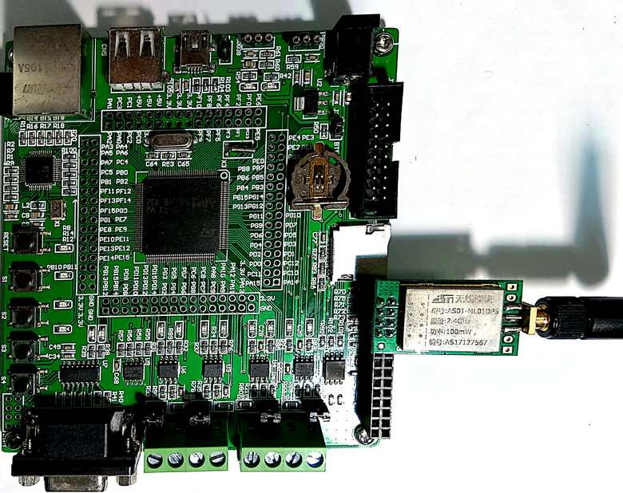

# Network_Transmitter

ZJUNlict Network Transmitter Design for the Robocup Soccer Small-Size League https://zjunlict.cn/

The network Transmitter is based on commercial STM32F407 development board shown in the figure below which provides both network (RJ45) and nRF24L01P (SPI) interface. The cost of using existing solution is much less than self designed ones. The network tranmitter uses network interface to communicate with PC instead of [legacy transmitter](https://github.com/ZJUNlict/Transmitter) virtual USB to UART to eliminate possible transfer rate limit and improve latency in the mean time. Two network tramsmitters (one for transmitt and one for receive) are used as a pair in comptitions. 

The main features are:

* STM32F407ZET6 acts as the main controller to validate the recived UDP package from PC and sends to nRF24L01P. (Transmit one)
* STM32F407ZET6 receives the package from nRF24L01P and send to PC. (Receive one)

